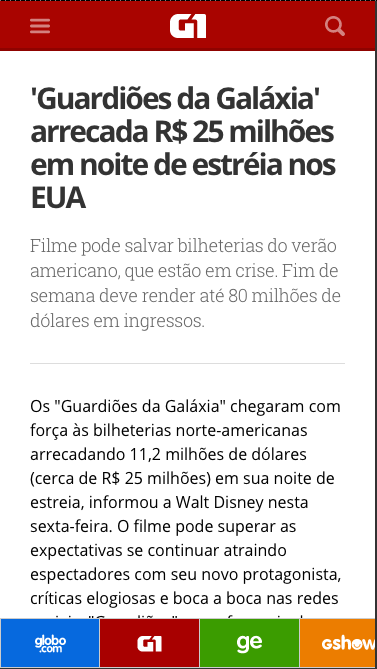
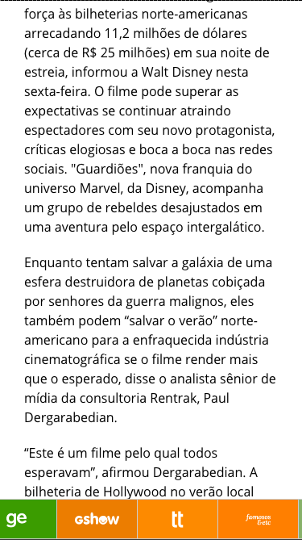

## << Nome do candidato >>
**Globo.com: coding challenge**

====================
#### Considerações Gerais
Você deverá usar este repositório como o repo principal do projeto, i.e., todos os seus commits devem estar registrados aqui, pois queremos ver como você trabalha.

**Registre tudo**: testes que forem executados, ideias que gostaria de implementar se tivesse mais tempo (explique como você as resolveria, se houvesse tempo), decisões que forem tomadas e seus porquês, arquiteturas que forem testadas e os motivos de terem sido modificadas ou abandonadas. Crie um arquivo COMMENTS.md ou HISTORY.md no repositório para registrar essas reflexões e decisões.

Leia todo esse documento com atenção e até o final (as dicas também são importantes).

=====================
#### O Desafio

O desafio que você deverá desenvolver é a página com a nova "Regua de navegação" mobile da globo.com. Utilizando essa nova navegação, podermos ir para os principais portais da globo.com com facilidade.

A página deve ser possível de ser rodada localmente com algum server por trás.

Só é necessário funcionar bem em celulares (não precisando testar em tablets ou desktop). A página deve funcionar nos principais browsers mobile do mercado em suas últimas versões.

Você pode utilizar esse repositório como modelo de partida para sua solução.

============================
#### Para rodar o Projeto modelo

Esse repositório modelo utiliza-se de Makefile, ruby 2.1.0 e node 0.12 para executar suas ações e você pode utilizar essas funcionalidades como ponto de partida.

Para configurar o projeto:

* make setup

Para rodar o servidor de exemplo:

* make run

Para compilar os estáticos:

* make compile (compila minificado)
* make watch (compila desminificado a cada vez que um arquivo *.scss e/ou *.coffee for modificado)

============================
#### Regras de negócio

Abaixo tem [imagens finais](#exemplo-regua-final) explicando visualmente como esperamos que a barra de navegação fique e se comporte.

Segue uma descrição técnica das features:

1. A barra de navegacao deve ser um componente que ocupa toda a largura da página e fica fixa na parte inferior desta página.

2. A barra deve ter 50px de altura.

3. Cada marca presente na barra deve ter um retangulo em sua volta e com a marca centralizada verticalmente e horizontalmente em relação a esse retangulo.

4. Cada retangulo tem: 1px de borda de algum tom de cinza / 100px de largura / os mesmos 50px de altura da barra / cor de fundo da marca a ser explicado mais adiante.

5. Cada marca é um svg que deve ser colorido em branco. Deve ser possível clicar na marca e ir para a página principal daquele produto.

6. Para pegar a cor, tamanho (width e height que o svg deve ter ao aparecer, sendo que a altura é no máximo 25px e a largura no máximo 55px) e link de cada marca, utilize via ajax o seguinte json: https://matchesjson.herokuapp.com/products.json

7. Os svgs das marcas estão na raiz pasta src/svg. Cada nome de arquivo é também uma propriedade do json acima (permitindo fazer assim o mapeamento de tamanho, cor e link relativo).

8. Deve ser possível ver todas as marcas através de swipe, ou seja, a barra é também um carrossel de marcas.

9. Não tem uma ordem definida para quando cada marca aparecerá.

#### Requisitos técnicos e adicionais

Concentre-se em fazer o principal, antes de qualquer adicional listado abaixo.

1. Você pode utilizar qualquer runner, pre-processador e compilador de estáticos que queira ou usar css, js e html puro (não é necessário utilizar nada pronto desse projeto modelo).

2. Você pode utilizar qualquer biblioteca externa que queira para auxiliar na sua solução (é um adicional se conseguir fazer sem utilizar jquery).

3. Dica para o carrossel, caso nunca tenha feito um: http://iscrolljs.com/

4. É um adicional se utilizar pre-processadores como scss e/ou coffee.

5. É um adicional se cacheasse o json de marcas no localstorage por 15 mins, antes de fazer o request novamente.

6. É um adicional se criar um sprite com os svgs antes de utilizar na solução (assim como é um adicional se cachear esse mesmo sprite svg no localstore).

7. É um adicional se conseguir incluir testes automatizados pro que fizer sentido na solução final.
 
#### Exemplo da regua final 

Posição inicial:

Depois de fazer scroll para baixo na página e um pouco de swipe para esquerda:

Depois de fazer scroll de volta para cima na página e swipe para esquerda até o fim:

===============================================
#### O que será avaliado na sua solução?

1. As funcionalidades listadas anteriormente devem estar presentes na sua solução.
2. Os adicionais listados que você conseguiu incluir.
3. Qualquer outra solução criativa extra que seja feita por você.
4. Seu código será observado por uma equipe de desenvolvedores que avaliarão a simplicidade e clareza da solução, a arquitetura, documentação, estilo de código, o design da interface e a implementação do código.

=============
#### Dicas

- É melhor para nós que você termine uma solução pequena do que tentar fazer a mais completa.
- Se nunca usou svg ou nunca fez um sprite com svgs, então utilize o helper que entregamos no index.erb chamado include_svg para criar uma primeira versão com todos os svgs incluídos inline e depois pense em melhorá-la.
- Escolha um para começar: js ou coffee. Se nunca utilizou CoffeScript, então você provavelmente perderá muito tempo com os seus detalhes e sugerimos fazer com js (se depois der tempo e quiser fazer em coffee, tudo bem).
- Qualquer outra biblioteca que for usar, dê preferência pelas open source e documente as decisões e os porquês;
- Automatize o que for possível;
- Em caso de dúvidas, pergunte.
